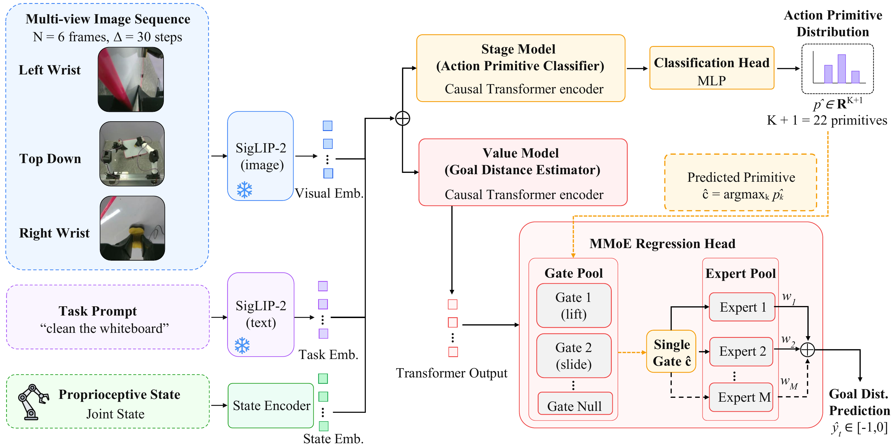

<div align="center">


# SARM / SARM2: Stage-Aware Reward Modeling for Long Horizon Robot Manipulation


**SARM** &nbsp;[Project Page](https://qianzhong-chen.github.io/sarm.github.io/) · [Arxiv](https://arxiv.org/abs/2509.25358)
&nbsp;&nbsp;|&nbsp;&nbsp;
**SARM2** &nbsp;[Project Page](https://qianzhong-chen.github.io/sarm2.github.io/) · [Arxiv](https://arxiv.org/abs/2606.10305)

</div>

<div align="center">
  
</div>


This repository provides training and evaluation scripts for a family of stage-aware reward models on both the LeRobot dataset and raw robot trajectories:

- **SARM** &mdash; single-task, stage-aware reward model (a *stage estimator* + a *subtask progress* head).
- **SARM2** &mdash; **multi-task** stage-aware reward model that replaces SARM's per-task stage annotations with a task-agnostic **action-primitive** vocabulary and a **multi-gate Mixture-of-Experts (MMoE)** value head, producing dense per-step rewards across many manipulation tasks within a single model.
- **ReWiND** &mdash; our reproduction of the [ReWiND](https://arxiv.org/abs/2505.10911) baseline.

Each model also supports **offline reward labeling** of raw robot rollouts (used to relabel autonomous rollouts in a self-improvement loop).


## Models & configs

| Config (`--config-name`) | Workspace | What it is |
|---|---|---|
| `rewind` | `ReWiNDWorkspace` | ReWiND baseline (single task). |
| `sarm` | `SARMWorkspace` | **SARM**: stage estimator + subtask progress head (single task). |
| `act_pri` | `ActPriWorkspace` | **SARM2 stage estimator**: task-agnostic action-primitive classifier (`K+1 = 22` classes). |
| `sarm2` | `SARM2Workspace` | **SARM2 reward model**: act-primitive-gated MMoE value decoder (multi-task). |
| `label/rewind_label` · `label/sarm_label` · `label/sarm2_label` | `*LabelWorkspace` | Offline reward labeling of raw rollouts (writes `reward.npy` / `progress.npy`). |

All configs live under `config/` (label configs under `config/label/`); encoders, model sizes, dataset paths, and checkpoint paths are set there.


## SARM2

<div align="center">
  
</div>

SARM2 is a **multi-task** stage-aware reward model. Three camera views plus proprioceptive state are encoded by a shared **frozen SigLIP-2** backbone, whose cached frame embeddings feed two *separately trained* causal Transformers:

1. **Action-Primitive Stage Estimator** (`act_pri`) &mdash; a task-agnostic 4-layer causal Transformer that classifies the current segment over `K+1 = 22` candidates (`K = 21` action primitives + a null/fallback class). Because the primitive vocabulary is shared across tasks, this stage estimator transfers to new tasks without per-task annotation. Implemented as `ActionTransformer` (`models/action_estimator.py`), trained with cross-entropy.

2. **MMoE Value Decoder** (`sarm2`) &mdash; a 6-layer causal Transformer whose head is a **multi-gate Mixture-of-Experts**. The `K+1` primitives are clustered into `M+1 = 8` semantic groups (Acquire, Release, Translate, Insert, Shape Clothes, Rotate, Force, Other); the *predicted primitive* selects the corresponding gate, which routes the fused token through **top-k** of a shared expert pool. The head predicts a normalized *remaining-steps-to-completion* value `r* = -(T-t)/T ∈ [-1, 0]`. Implemented as the multi-gate `RewardTransformer` (`models/moe_deco_gate_reward_model.py`), trained with MSE + per-gate load-balance / entropy auxiliary losses.

At inference the predicted primitive both supplies the value head's primitive embedding **and** selects its MoE gate, so the value estimate specializes to the action currently being performed.


## Configurations & Installation

We recommend using [uv](https://github.com/astral-sh/uv) for dependency management.  

### 1. Clone the repository:
```bash
git clone https://github.com/xdofai/opensarm
```

### 2. Install `uv`
```bash
pip install uv
```

### 3. Sync environment
```bash
uv sync
```

### 4. Activate environment
```bash
source .venv/bin/activate
```


## Training

### SARM (single task)
```bash
python train.py --config-name sarm
```

### SARM2 (multi task)
SARM2 is trained in **two stages** — first the action-primitive stage estimator, then the MMoE value decoder that consumes it:

```bash
# 1) Train the action-primitive stage estimator
python train.py --config-name act_pri

# 2) Point sarm2's `model.act_pri_model_path` at the act_pri checkpoint from step 1,
#    then train the MMoE value decoder (act_pri can be frozen or jointly finetuned
#    via `model.finetune_act_pri`).
python train.py --config-name sarm2
```

### ReWiND baseline
```bash
python train.py --config-name rewind
```


## Evaluation

`eval.py` selects what to run with `--mode` (default `eval`):

| `--mode` | Action |
|---|---|
| `eval` | Evaluate on the LeRobot dataset validation set. |
| `raw_data` | Evaluate on a directory of raw robot trajectories. |
| `label` | Label raw rollouts with per-frame reward (writes `reward.npy` / `progress.npy`). |
| `label_mp` | Same as `label`, sharded across GPUs (multi-process). |
| `clear` | Remove previously written `reward.npy` / `progress.npy`. |

```bash
# Validation set
python eval.py --config-name sarm2
python eval.py --config-name act_pri

# Raw robot trajectories
python eval.py --config-name sarm2 --mode raw_data
```


## Reward Labeling

Any trained reward model can label a directory of raw robot rollouts with dense per-frame rewards.
Each rollout writes `reward.npy` and `progress.npy` into its episode folder (per-frame, aligned to the
episode's `timestamp.npy`). Set `eval.label_data_dir` (and `eval.ckpt_path*`) in the chosen config.

```bash
# SARM2 / SARM / ReWiND labelers (configs live under config/label/)
python eval.py --config-name label/sarm2_label  --mode label
python eval.py --config-name label/sarm_label   --mode label
python eval.py --config-name label/rewind_label --mode label

# Multi-GPU labeling, or clear existing labels
python eval.py --config-name label/sarm2_label  --mode label_mp
python eval.py --config-name label/sarm2_label  --mode clear
```

The code for labeling rollouts to finetune the reward model lives in `label_data`.

---

## Notes
- Top-level configs are under `config/`; labeling configs are under `config/label/`.
- Swap `--config-name` among `rewind`, `sarm`, `act_pri`, `sarm2` (and their `label/*` variants) to run a different model.
- SARM/ReWiND use a CLIP encoder; SARM2 (`act_pri` + `sarm2`) uses a frozen SigLIP-2 encoder — keep a config's encoder consistent with the checkpoint you load.

## Dataset Clarification
### We use a modified [LeRobotDataset](https://huggingface.co/docs/lerobot/en/lerobot-dataset-v3)  structure:
```bash
A typical LeRobotDataset looks like this from its root path:
        .
        ├── data
        │   ├── chunk-000
        │   │   ├── episode_000000.parquet
        │   │   ├── episode_000001.parquet
        │   │   ├── episode_000002.parquet
        │   │   └── ...
        │   ├── chunk-001
        │   │   ├── episode_001000.parquet
        │   │   ├── episode_001001.parquet
        │   │   ├── episode_001002.parquet
        │   │   └── ...
        │   └── ...
        ├── meta
        │   ├── episodes.jsonl
        │   ├── info.json
        │   ├── stats.json
        │   └── tasks.jsonl
        └── videos
            ├── chunk-000
            │   ├── left_camera-images-rgb
            │   │   ├── episode_000000.mp4
            │   │   ├── episode_000001.mp4
            │   │   ├── episode_000002.mp4
            │   │   └── ...
            |   ├── right_camera-images-rgb
            │   │   ├── episode_000000.mp4
            │   │   ├── episode_000001.mp4
            │   │   ├── episode_000002.mp4
            │   │   └── ...
            |   ├── top_camera-images-rgb
            │   │   ├── episode_000000.mp4
            │   │   ├── episode_000001.mp4
            │   │   ├── episode_000002.mp4
            │   │   └── ...
            ├── chunk-001
            └── ...
```
### Parquet schema (per timestep)

Each `episode_XXXXXX.parquet` stores a time-series trajectory.  
**Each row corresponds to one timestep** and contains the following columns:

| Column          | Type            | Shape | Dtype    | Description |
|----------------|-----------------|-------|----------|-------------|
| `state`        | `np.ndarray`    | (state_dim,) | float64  | Robot state vector at time *t*. |
| `actions`      | `np.ndarray`    | (act_dim,) | float64  | Action vector applied at time *t*. |
| `reward`       | `np.ndarray`    | (1,)  | float32  | Scalar **progress** at time *t*. |
| `timestamp`    | `np.ndarray`    | (1,)  | float64  | Timestamp (seconds). |
| `frame_index`  | `np.ndarray`    | (1,)  | int64    | Frame id in the video stream. |
| `episode_index`| `np.ndarray`    | (1,)  | int64    | Episode id (redundant but convenient for joins). |
| `index`        | `np.ndarray`    | (1,)  | int64    | Global step index (or row index). |
| `task_index`   | `np.ndarray`    | (1,)  | int64    | Task id (maps to `meta/tasks.jsonl`). |

**Note:** Despite its name, `reward` stores the absolute task progress (value) rather than a reinforcement learning reward.


## Acknowledgements
- The repository structure is adapted from [diffusion_policy](https://github.com/real-stanford/diffusion_policy).
- The dataset format follows the [LeRobotDataset](https://huggingface.co/docs/lerobot/en/lerobot-dataset-v3) specification.
- The *ReWiND* model included in this repository is our reproduction from the [paper](https://arxiv.org/abs/2505.10911); please refer to the official [**ReWiND**](https://github.com/rewind-reward/ReWiND) repository for the original implementation.


## Citation

If you find our papers or code useful, please consider citing:
```bibtex
@inproceedings{
chen2026sarm,
title={{SARM}: Stage-Aware Reward Modeling for Long Horizon Robot Manipulation},
author={Qianzhong Chen and Justin Yu and Mac Schwager and Pieter Abbeel and Fred Shentu and Philipp Wu},
booktitle={The Fourteenth International Conference on Learning Representations},
year={2026},
}

@article{chen2026sarm2,
  title={SARM2: Multi-Task Stage Aware Reward Modeling for Self Improving Robotic Manipulation},
  author={Chen, Qianzhong and Zheng, Hau and Yu, Justin and Huang, Suning and Sun, Jiankai and Goldberg, Ken and Wen, Chuan and Abbeel, Pieter and Shentu, Yide and Wu, Philipp and others},
  journal={arXiv preprint arXiv:2606.10305},
  year={2026}
}
```